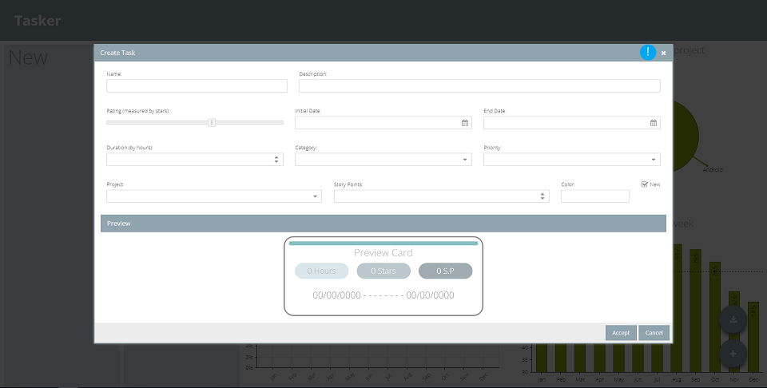
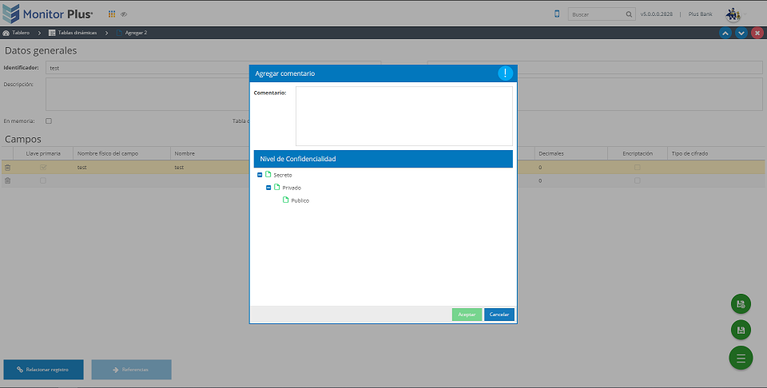
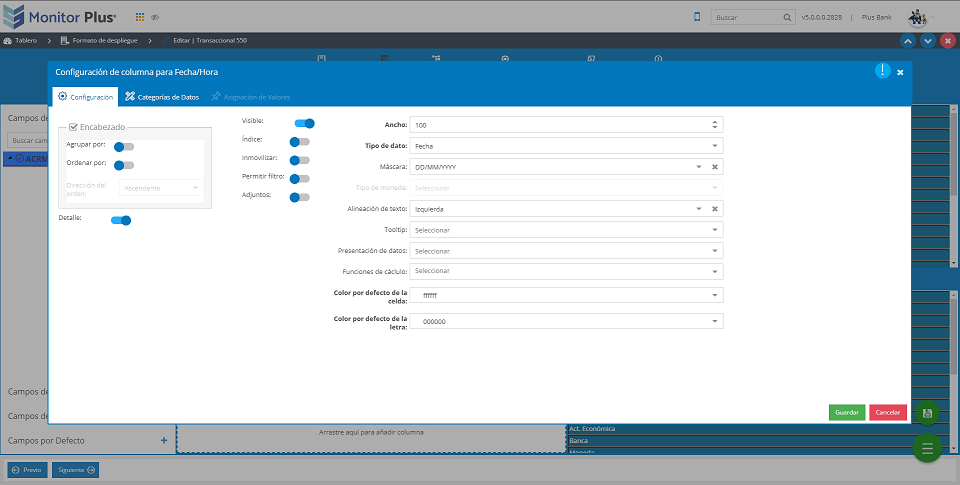

# Componente window

Aqui podemos realizar una comparacion entre el proyecto
tasker y M5 en donde podremos observar 
como es que se utiliza el componente en los dos proyectos.

Para identificar el componente 
este tendra un circulo color celeste con un signo
de admiracion blanco.

Para regresar a el menu anterior dar click [aqui](../../main.html)

### Proyecto Tasker

### Componente global de guardar con nivel de confidencialidad

### Mantenimiento de formato despliegue

